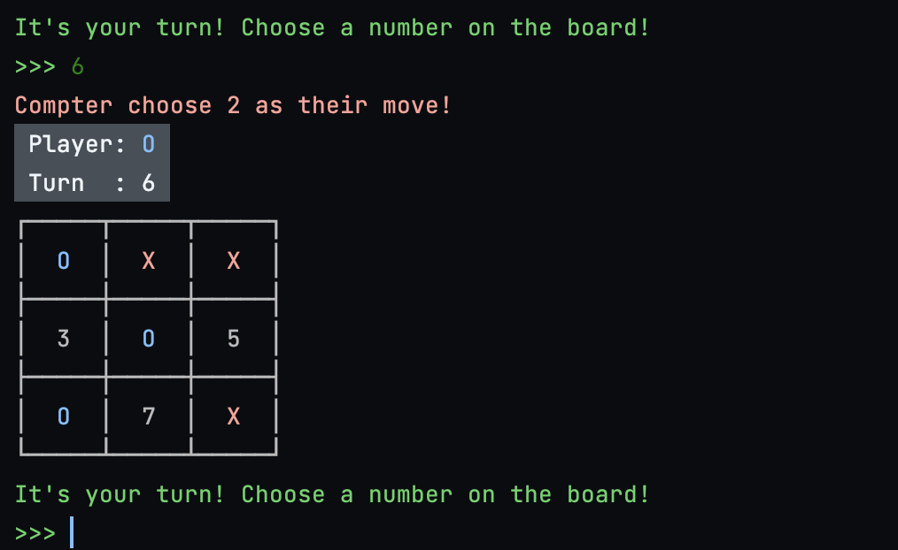

# tic-tac-toe-with-AI
### A terminal based tic-tac-toe game with AI only using python and random module.
This project was made to understand recursive functions.

  

## Requirements
- Python 3.9 or above
- Random module (Pre-installed with python)

## How to play
1. Clone the repository. `git clone https://github.com/SuhJae/tic-tac-toe-with-AI.git`
2. Run the game. `python3 main.py` or `python main.py`
3. Enjoy the game!